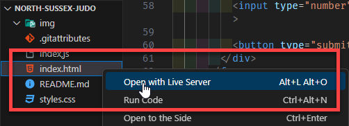
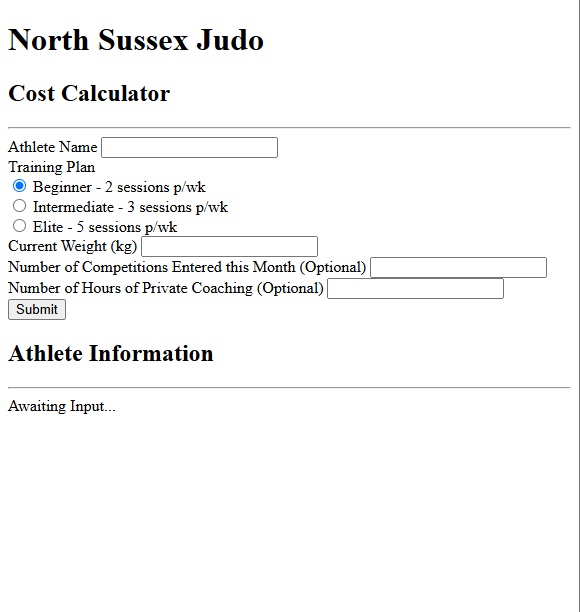
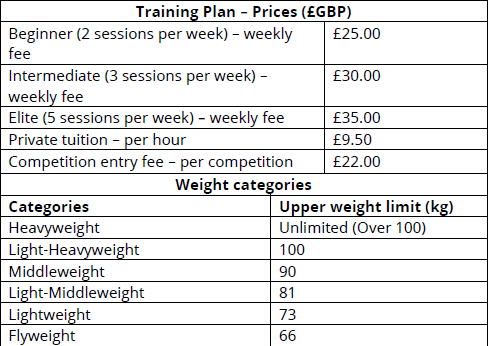

# North Sussex Judo

Starter code for individual programming project.

## Getting started

Right-click **index.html** and select "Open with Live Server" from the dropdown list:

> ### NOTE
>
> If you don't have Live Server installed in VS Code, you can download it [here](https://marketplace.visualstudio.com/items?itemName=ritwickdey.LiveServer).

Your web browser should start and display the screen below:

## Scenario

You work for AQDS, a software development company.

AQDS who has been approached by a small, local company – North Sussex Judo – that specialises in providing judo training sessions to people from the local community. North Sussex Judo caters to people of all ages and experience, from expert to beginner.

North Sussex Judo has requested a program that will calculate the cost of training fees for their athletes each month.

The CEO of the company has reviewed the client requirements and has determined that this is a suitable project for you to take on. The company wants to see how you use and apply the ADQS development environments and code standards.

The requirements are that North Sussex Judo wants a program that will allow a user to enter the following information:

- athlete name
- training plan
- current weight in kilograms (kg)
- competition weight category
- number of competitions entered this month
- option to add the number of hours private coaching.

For each athlete, the program should then output the following information:

- the athlete’s name
- an itemised list of all costs for the month
- the total cost of training and competitions for the month
- how their current weight compares to their competition weight category.

North Sussex Judo currently have six athletes enrolled on their training program, but they would like the ability to register more.

You should use the additional information below to help you when developing your program.

Once the program has been built, the CEO has asked you to report back to them on how you designed and developed the algorithms required, as well as how you converted these algorithms into a final program and to show any issues you encountered.

As part of your report, the CEO wants you create a presentation for the development team showing the different programming paradigms available, as well as the debugging tools you used as part of the program development, so that the development team can review your progress.

### Additional information

- Athletes can receive a maximum of five hours’ private coaching a week
- Only Intermediate and Elite athletes can enter competitions
- Competitions are held on the second Saturday of each month
- All prices and costs should be displayed as currency to two decimal places
- The program deals with user error by displaying suitable messages to the user and then prompting them for another go
- North Sussex Judo assumes that a month consists of four weeks.

### Instructions

1. You are required to develop a program for North Sussex Judo that makes use of appropriate algorithms to fulfil the given client requirements above. You should make use of whichever tools and techniques are most appropriate for your chosen coding paradigm and for the nature of the software solution.
2. You are to write a report that details the process that would be required to design the algorithm for the solution and how you turned the algorithm into a working application. Your report should include the following:
   - A definition, written in the design tool of your choosing, of the algorithm required for the implementation of the North Sussex Judo program
   - An outline of the steps required to build the application
   - A description of the steps required for converting the algorithm into a working program, including identification of a suitable programming language
   - An analysis of the relationship between the algorithm and program code to be produced (e.g. parts of the algorithm that would remain the same, changes that would have to be made)
   - An analysis of the possible challenges you would face when converting the designed algorithm into program code (e.g. data types/structures available in the chosen language, control structures required)
   - An explanation of the coding standards you used in your source code.
   - As part of your written report, you should clearly show how you have enhanced your original algorithm, using the features of the IDE to manage the development process. This could include:
     - identifying and solving any logical errors in the original algorithm
     - debugging any errors in the program
     - using version control within your IDE to track and monitor changes in the algorithm
     - using performance monitoring tools to optimise the algorithm
     - refining and optimising the algorithm using different code constructs.

You will include your final, annotated source code and working application as part of your report.

### Submission format

1. **Program Source Code** – annotated/commented source should be produced in the format created by the programming language selected (for example: `.js`, `.css`, `.html` files).

2. **Implemented program (final working version)** in format suitable to be run and assessed for functionality – this will be a link to your Github repository where the project files are stored.

3. **A written report** to identify and define the algorithms used in the development of the solution as well as an analysis and discussion of the steps taken in writing the program and the challenges faced. The report will also clearly explain any coding standards used, as well as how algorithms have been enhanced during the course of development.
